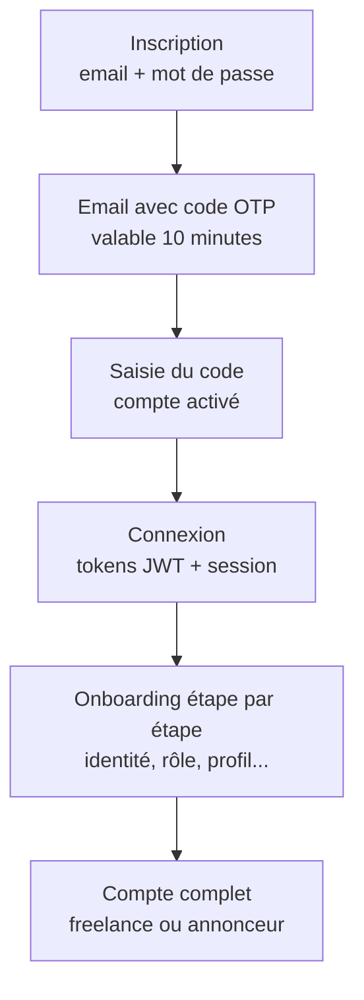

# Application `User` — Comptes, authentification et onboarding

## À quoi sert cette application ?

C'est la **fondation** de la plateforme. Elle gère tout ce qui touche aux
personnes : créer un compte, prouver son identité par email, se connecter,
récupérer son mot de passe, choisir son rôle (freelance ou annonceur),
compléter son profil étape par étape (onboarding) et gérer sa photo.

> **Analogie pour non-développeur** : c'est le « service d'état civil » de
  Jëfly. Il délivre la carte d'identité (compte), vérifie l'identité (code
  par email), tient le registre des entrées (sessions) et accompagne la
  personne jusqu'à ce que son dossier soit complet (onboarding).

## Le parcours d'un nouvel utilisateur

## Les concepts clés, expliqués simplement

- **OTP** (*One-Time Password*) : code à 6 chiffres envoyé par email, valable
  10 minutes, utilisable une seule fois. Il prouve que l'email appartient
  bien à la personne qui s'inscrit.
- **JWT** (*JSON Web Token*) : « badge d'accès » remis à la connexion. Le
  frontend le présente à chaque requête. Le badge d'accès dure 9 heures, le
  badge de renouvellement 14 jours.
- **Session** : trace de chaque connexion enregistrée en base (appareil,
  adresse). L'utilisateur peut consulter ses sessions actives et repérer une
  connexion suspecte.
- **Rôle** : `freelance` ou `annonceur`. Choisi **une seule fois** et
  définitivement — le modèle `User` refuse toute modification ultérieure.
- **Onboarding** : parcours guidé en étapes, pour compléter le profil après
  la première connexion.

## Les fichiers, un par un

### `models.py` — Les données gérées

**`User` (le compte)** : hérite du système d'utilisateurs de Django, adapté
à Jëfly :

| Champ | Signification |
|---|---|
| `email` | Identifiant de connexion unique (remplace le « username » classique). |
| `first_name` / `last_name` / `number_phone` | État civil, rempli pendant l'onboarding. |
| `password` | Jamais stocké en clair : haché automatiquement. |
| `profile_picture` | Photo de profil (URL Cloudinary). |
| `is_verified` | Devient `True` quand l'email a été confirmé par OTP. |
| `role` | `freelance` ou `annonceur`, ou vide tant que non choisi. |
| `onboarding_completed` / `onboarding_step` | Où en est la personne dans le parcours guidé. |
| `googleId` | Réservé à une future connexion via Google. |

La méthode `save` contient une **protection forte** : si le rôle a déjà été
attribué, toute tentative de changement lève une erreur. Le rôle est un
engagement définitif.

**`optCode` (les codes de vérification)** : code à 6 chiffres, date de
création, date d'expiration (10 minutes), indicateur `is_used`. Un code
consommé ne peut pas resservir.

**`session` (les connexions actives)** : token, appareil, localisation,
indicateur `is_active`, dates de création et de dernière utilisation,
expiration.

**`UserManager`** : adapte la création de comptes à la connexion par email
(`create_user`, `create_superuser`).

### `serializers.py` — Les traducteurs et les validations

Chaque flux a son serializer, avec des messages d'erreur **en français**,
rattachés au champ concerné :

- **`RegisterSerializer`** : email unique (recherche insensible à la casse —
  `Jean@Mail.com` et `jean@mail.com` sont le même compte), confirmation du
  mot de passe obligatoire, et une **politique de mot de passe** exigeante :
  8 caractères minimum, une majuscule, un chiffre, un caractère spécial.
  Toutes les erreurs sont renvoyées **d'un coup** pour éviter à
  l'utilisateur de corriger une règle à la fois.
- **`LoginSerializer`** : vérifie les identifiants. Si l'email n'existe pas,
  une comparaison de mot de passe factice est malgré tout effectuée : la
  durée de réponse est identique, ce qui empêche de deviner quels emails
  existent en chronométrant le serveur.
- **`VerifyEmailSerializer`** : contrôle le code OTP (présent, 6 chiffres,
  non utilisé, non expiré).
- **`PasswordResetRequestSerializer` / `PasswordResetConfirmSerializer`** :
  demande et confirmation de réinitialisation.
- **`SessionSerializer`** : le token est `write_only` — il est accepté en
  entrée mais **jamais renvoyé** dans les réponses.
- **`ProfileSerializer` / `UpdateProfileSerializer` /
  `DeleteProfileSerializer`** : lecture, mise à jour et suppression du
  compte (la suppression exige le mot de passe actuel).
- **`RoleSelectionSerializer`** : valide le choix du rôle et refuse tout
  changement après coup.

### `views.py` — Les orchestrateurs

**`AuthViewSet`** : les flux d'authentification. Chaque action est
documentée dans le code avec son endpoint, son payload et ses réponses :

| Action | Endpoint | Description |
|---|---|---|
| `register` | `POST /api/auth/register/` | Crée le compte (non vérifié) et envoie le code OTP. |
| `verify-email` | `POST /api/auth/verify-email/` | Vérifie le code et active le compte. |
| `login` | `POST /api/auth/login/` | Vérifie les identifiants, émet les tokens JWT, crée la session. |
| `password-reset` | `POST /api/auth/password-reset/` | Envoie un lien de réinitialisation. La réponse est **identique** que le compte existe ou non (on ne révèle rien). |
| `new-password` | `POST /api/auth/new-password/` | Définit le nouveau mot de passe via le lien reçu. |
| `select-role` | `POST /api/auth/select-role/` | Enregistre le rôle, définitivement. |
| `get-all-sessions` | `GET /api/auth/get-all-sessions/` | Liste les sessions actives de l'utilisateur. |

Détails de sécurité notables :

- à l'inscription, si l'envoi de l'email échoue, le compte **est quand même
  créé** et la réponse l'explique : l'utilisateur pourra redemander un code ;
- le lien de réinitialisation est construit avec un identifiant encodé
  (`uidb64`) et un jeton à usage unique valable une heure ;
- la connexion enregistre l'appareil (navigateur) et l'adresse IP dans la
  session.

**`ProfileViewSet`** : gestion de **son propre** compte — lecture
(`GET /api/profile/`), mise à jour (`PATCH`), suppression (`DELETE`, avec
mot de passe obligatoire). Aucun identifiant dans l'URL : on ne peut agir
que sur soi-même.

**`UserProfileView`** : upload et suppression de la **photo de profil**,
via Cloudinary (voir `utils.py`).

**`MeViewSet`** : raccourci `GET /api/me/` pour lire son profil.

### `email_service.py` — L'envoi des emails

Service dédié au prestataire **Resend**. Deux fonctions :

- `send_otp_email` : le code de vérification ;
- `send_password_reset_email` : le lien de réinitialisation.

Points importants :

- chaque email existe en version **HTML** (template du dossier
  `templates/emails/`) et en version **texte** de secours ;
- les fonctions ne **lèvent jamais d'exception** : elles renvoient un
  dictionnaire `{success, error, email_id}`. À l'appelant de décider quoi
  faire de l'échec — c'est ce qui permet, par exemple, de créer le compte
  même si l'email part mal ;
- la configuration (clé API, adresse d'expéditeur) vient de variables
  d'environnement, jamais du code.

### `utils.py` — Les images Cloudinary

Fonctions partagées avec `Technologie` :

- `validate_image_file` : type MIME (JPEG / PNG / WebP) et taille (5 Mo max) ;
- `upload_image` : envoie l'image et renvoie l'URL sécurisée ;
- `upload_profile_image` : spécialise l'upload pour les photos de profil ;
- `delete_profile_image` / `extract_public_id_from_url` : suppression d'une
  image à partir de son URL ;
- deux exceptions distinctes : `InvalidImageError` (faute du client) et
  `CloudinaryError` (panne du service externe).

### `onboarding_views.py` + `onboarding_serializers.py` — Le parcours guidé

L'onboarding est un **assistant pas-à-pas**. Une seule vue générique
dispatche selon le nom de l'étape :

| Endpoint | Rôle |
|---|---|
| `POST /api/onboarding/{step}/` | Soumettre une étape |
| `POST /api/onboarding/skip/{step}/` | Sauter une étape optionnelle |
| `POST /api/onboarding/back/{step}/` | Revenir sur une étape |
| `GET /api/onboarding/status/` | Où en est l'utilisateur |

Les séquences diffèrent selon le rôle :

- **Freelance** : identite → role → presentation → service → technologies →
  experience → formation → realisations → finalisation ;
- **Annonceur** : identite → role → type_annonceur → infos_entreprise →
  finalisation (l'étape `infos_entreprise` est sautée pour un particulier).

Les étapes `experience`, `formation` et `realisations` sont **optionnelles**
(sautables) ; toutes les autres sont **obligatoires**. Chaque étape a son
propre serializer avec ses validations isolées, et la vue met à jour
`onboarding_step` au fil de l'eau — le frontend peut ainsi pré-remplir les
formulaires en cas de reprise à mi-parcours.

### `urls.py` — Le plan des adresses

Enregistre `auth` et `profile` via le routeur, puis ajoute les chemins
`profile/photo/`, `me/` et les quatre routes d'onboarding.

## Liens avec les autres applications

- `announcer` / `freelance` : le rôle choisi conditionne le profil créé ;
  l'onboarding écrit directement dans ces applications.
- `Technologie` / `Service` : catalogues proposés pendant l'onboarding.
- `config` : fournit JWT, CORS et les réglages globaux.

## Points d'attention

- La connexion Google (`googleId`) est préparée mais non implémentée.
- La déconnexion ne révoque pas encore les sessions en base (le frontend
  supprime simplement ses tokens) : une vraie révocation côté serveur serait
  plus sûre.
- `MAX_ACTIVE_SESSIONS` (5 par défaut) est défini dans les réglages mais
  aucune logique ne l'applique encore.
